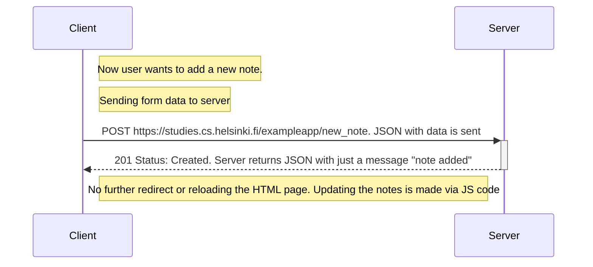

```mermaid
sequenceDiagram
    Note right of Client: Now user wants to add a new note.

    Note right of Client: Sending form data to server
    Client->>+Server: POST https://studies.cs.helsinki.fi/exampleapp/new_note. JSON with data is sent
    Server-->>-Client: 201 Status: Created. Server returns JSON with just a message "note added"
    Note right of Client: No further redirect or reloading the HTML page. Updating the notes is made via JS code

```
