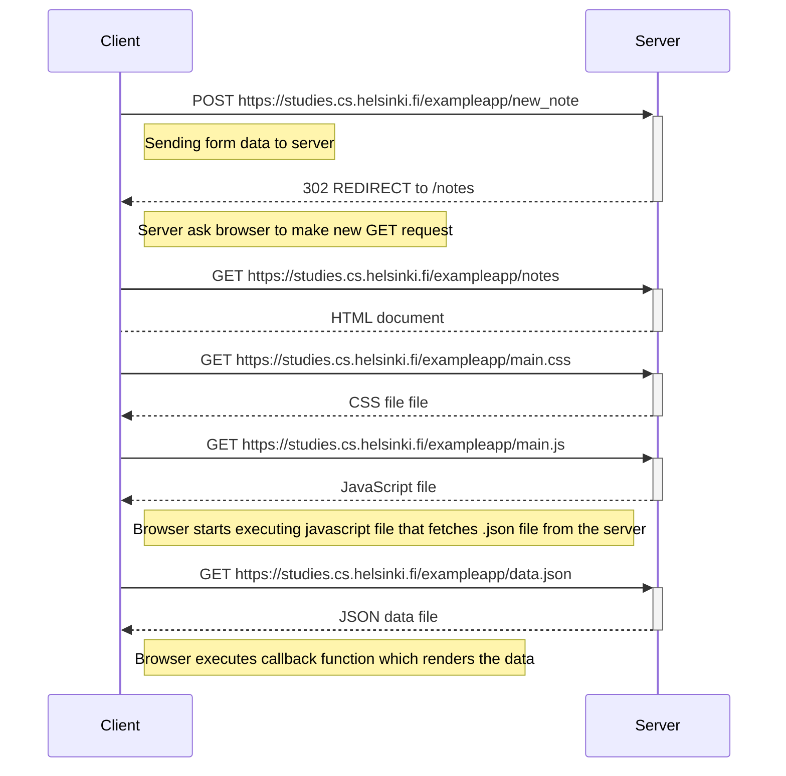

```mermaid
sequenceDiagram
    Client->>+Server: POST https://studies.cs.helsinki.fi/exampleapp/new_note
    Note right of Client: Sending form data to server
    Server-->>-Client: 302 REDIRECT to /notes
    Note right of Client: Server ask browser to make new GET request
    Client->>+Server: GET https://studies.cs.helsinki.fi/exampleapp/notes
    Server-->-Client: HTML document
    Client->>+Server: GET https://studies.cs.helsinki.fi/exampleapp/main.css
    Server-->>-Client: CSS file file
    Client->>+Server: GET https://studies.cs.helsinki.fi/exampleapp/main.js
    Server-->>-Client: JavaScript file
    Note right of Client : Browser starts executing javascript file that fetches .json file from the server
    Client->>+Server: GET https://studies.cs.helsinki.fi/exampleapp/data.json
    Server-->>-Client: JSON data file
    Note right of Client : Browser executes callback function which renders the data
```
